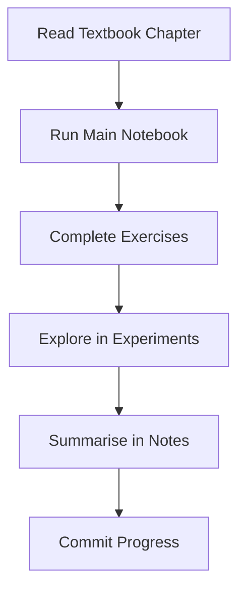

# Practical Statistics for Data Scientists (3rd Edition) — Python Implementation

> **A companion repository for working through *"Practical Statistics for Data Scientists, 3rd Edition"* by Peter Bruce, Andrew Bruce, and Peter Gedeck — strictly implemented in Python.**

[](https://python.org)
[](LICENSE)
[](https://colab.research.google.com)

---

## Table of Contents
1. [Purpose](#purpose)
2. [Chapter Progress](#chapter-progress)
3. [Study Workflow](#study-workflow)
4. [Quick Start Guide](#quick-start-guide)
5. [Tools & Libraries](#tools--libraries)
6. [Directory Structure](#directory-structure)

---

## Purpose

This repository documents my chapter-by-chapter journey through *Practical Statistics for Data Scientists (3rd Edition)* using Python. It serves as a personal learning environment to translate statistical concepts into actionable code, complete exercises, and run experiments.

---

## Chapter Progress

| Chapter | Topic | Status | Primary Notebook |
|:---|:---|:---:|:---|
| **[1](./chapter_01_exploratory_data_analysis/)** | Exploratory Data Analysis | ⬜ Not Started | [`01_eda.ipynb`](./chapter_01_exploratory_data_analysis/01_eda.ipynb) |
| **[2](./chapter_02_data_and_sampling_distributions/)** | Data and Sampling Distributions | ⬜ Not Started | [`02_data_distributions.ipynb`](./chapter_02_data_and_sampling_distributions/02_data_distributions.ipynb) |
| **[3](./chapter_03_statistical_experiments_and_significance_testing/)**| Statistical Experiments and Significance Testing | ⬜ Not Started | — |
| **[4](./chapter_04_regression_and_prediction/)**| Regression and Prediction | ⬜ Not Started | — |
| **[5](./chapter_05_classification/)** | Classification | ⬜ Not Started | — |
| **[6](./chapter_06_statistical_machine_learning/)** | Statistical Machine Learning | ⬜ Not Started | — |
| **[7](./chapter_07_unsupervised_learning/)**| Unsupervised Learning | ⬜ Not Started | — |

> **Legend:** ✅ Completed | 🔄 In Progress | ⬜ Not Started

---

## Study Workflow

For each chapter, the learning process follows a strict progression to ensure deep understanding:



**Standard Notebook Template:**

```python
# %% [markdown]
# # Chapter X: [Title]
# **Source**: Practical Statistics for Data Scientists, 3e, pp. XX-XX

# %%
# Import utilities and standardise visualisations
from utils.notebook_setup import *

# %%
# Load processed data for analysis
df = pd.read_csv('../datasets/processed/cleaned_data.csv')

```

---

## Quick Start Guide

### Option 1: Google Colab (Zero Setup)

1. Navigate to any `*.ipynb` file in this repository.
2. Click the **"Open in Colab"** badge at the top of the file, or upload it directly to [Colab](https://colab.research.google.com).
3. Run the cells sequentially.

### Option 2: Local Environment (Windows 10 + PowerShell)

**Prerequisites:** Python 3.12+, VS Code (with Jupyter extension), and Git.

```powershell
# 1. Clone the repository
git clone [https://github.com/beingAnujChaudhary/Practical-Statistics-for-DS-.git](https://github.com/beingAnujChaudhary/Practical-Statistics-for-DS-.git)
cd Practical-Statistics-for-DS-

# 2. Create and activate a virtual environment
python -m venv venv
.\venv\Scripts\Activate.ps1

# 3. Install dependencies
pip install -r requirements.txt

# 4. Launch VS Code
code .

```

---

## Tools & Libraries

This repository intentionally avoids overengineering and heavy ML frameworks until absolutely necessary. The core stack is kept lean:

* **Data Manipulation:** `pandas`, `numpy`
* **Visualisation:** `matplotlib`, `seaborn`, `plotly`
* **Statistics & ML Core:** `scipy`, `statsmodels`, `scikit-learn`
* **Utilities:** `jupyter`, `notebook`, `missingno`, `openpyxl`

---

## Directory Structure

```text
Practical-Statistics-for-DS/
│
├── README.md                 # Project overview
├── requirements.txt          # Python dependencies (pip)
├── .gitignore                # Git ignore rules
├── LICENSE                   # MIT License
│
├── assets/                   # Visual assets (covers, diagrams)
├── datasets/                 # Global datasets (raw, processed, external)
├── notes/                    # Global study notes and cheatsheets
├── utils/                    # Reusable Python helper scripts (plotting, stats)
│
├── chapter_01_exploratory_data_analysis/
│   ├── 01_eda.ipynb          # Main chapter implementation
│   ├── chapter_notes.md      # Markdown summary of key takeaways
│   ├── exercises.ipynb       # Python solutions to book exercises
│   ├── experiments.ipynb     # Personal extensions and sandbox
│   ├── datasets/             # Chapter-specific datasets
│   └── output/               # Local generated graphs and tables
│
├── chapter_02_data_and_sampling_distributions/
│   └── ... (Consistent structure across all chapters)
│
└── ...

```

---

> **Disclaimer**: This repository is strictly for educational purposes. All rights to the original text, conceptual examples, and proprietary datasets belong to the authors and O'Reilly Media. Please support the authors by purchasing *[Practical Statistics for Data Scientists, 3rd Edition](https://www.oreilly.com/library/view/practical-statistics-for/9781492072942/)*.

---

## Author

**Anuj Chaudhary** 🔗 [GitHub](https://github.com/beingAnujChaudhary)
